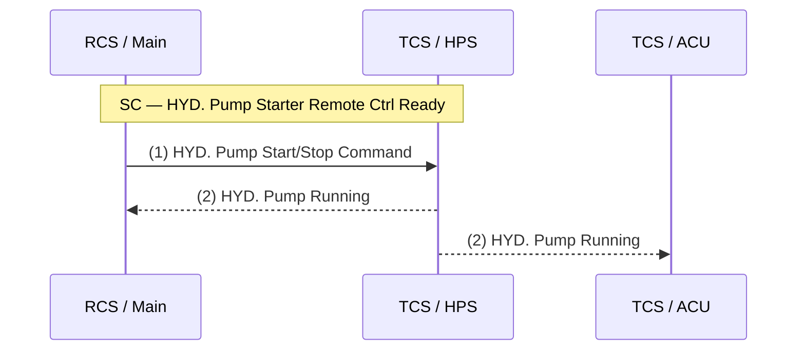

# Test Sheet — Data Structure Specification

Companion to [`PLAN.md`](PLAN.md). Defines the schema customers fill in.
A worked example is in [`customer_example.yaml`](customer_example.yaml).

> **Revision 0.4 changes (2026-05-15)** — internal SI workflow fields
>
> Two new optional fields added to `Signal`, used by the SI Data Explorer
> to track provenance and confidence. Both default to falsy values, so
> rev-0.3 YAML files round-trip unchanged.
>
> - `signal.assumed` — `bool`, default `false`. Set `true` when the value
>   could not be extracted verbatim from a vendor source document and was
>   instead inferred by the System Integrator. The Data Explorer renders
>   a *needs SI confirmation* badge for assumed signals (validation rule
>   SIG014, severity `info`).
> - `signal.source_doc_ref` — `str`, default `""`. Pointer back to the
>   source-document fragment (e.g. `vfd_io_datasheet_revC.pdf#p4`) the
>   value was extracted from. Free text; not validated.
>
> **Revision 0.3 changes (2026-05-14)**
>
> - Added required `signal.expected_value` — the assume-and-guarantee target
>   value used to derive a pass/fail verdict for the corresponding test
>   step. Shape mirrors `value_mapping`. See §10c.
> - Added validation rule SIG013: `expected_value` MUST be part of the
>   `value_mapping` range (discrete: enumerated entry; linear: inside the
>   `[low, high]` interval, inclusive, with matching units).
>
> **Revision 0.2 changes (2026-05-14)** — based on shipyard feedback and
> vendor IO datasheets `Screenshot 2026-05-14 152025.png` (DO) and
> `161837.png` (AI):
>
> - Documented `Module` semantics (physical or logical subdivision; flexible).
> - Clarified `control_authority` (issues primary/initiation command) vs
>   `related_systems` (participate via signals but do not issue the
>   initiation command; unordered, must be exhaustive).
> - Standardised the precondition term as **"Start Condition" (`SC`)** and
>   trip term as **"Trip Condition" (`TC`)** — used consistently everywhere.
> - Renamed `signal_name` semantics: it is a **vendor-neutral logical name**,
>   not a vendor IO tag. Vendor-specific tags live in
>   `signal.vendor_io_mappings[]`.
> - Added `signal.value_mapping` (structured digital/analog mapping).
> - Added `signal.subtype` (`NO`/`NC`, `steady`/`pulse`, sine/cosine, ...).
> - Added `signal.pulse_shape` (period, duty, count, pattern).
> - Added `signal.value_description` (free-text).
> - Added `signal.vendor_io_mappings[]` — captures per-vendor IO datasheet
>   columns (item, terminal, signal_type, details, logic, functionality, rev).

---

## 1. Top level

| Field        | Type             | Required | Description                                           |
|--------------|------------------|----------|-------------------------------------------------------|
| `project`    | `ProjectMeta`    | yes      | Project identifiers.                                  |
| `vendors`    | `list[Vendor]`   | no       | Vendor registry referenced by `vendor_io_mappings[]`. |
| `systems`    | `list[System]`   | yes      | All systems/components referenced anywhere.           |
| `functions`  | `list[Function]` | yes      | Every function to be tested.                          |
| `glossary`   | `dict[str, str]` | no       | Acronym expansions.                                   |

> **Serialisation.** The schema is defined as a Pydantic / JSON Schema model
> and is **serialisation-agnostic**. YAML is the recommended authoring format
> for test-sheet files because it supports comments, multi-line strings and
> produces reviewable diffs, but every example in this document round-trips
> losslessly to JSON via `yaml.safe_load` → `json.dumps`. The canonical
> machine-readable artefact published alongside the spec is
> `si_schema.schema.json` (JSON Schema, draft 2020-12), generated from the
> same Pydantic models.

## 2. `ProjectMeta`

| Field           | Type   | Required | Notes                                          |
|-----------------|--------|----------|------------------------------------------------|
| `name`          | `str`  | yes      | e.g. `Electric Propulsion System`.             |
| `customer`      | `str`  | yes      | e.g. `Shipyard A`.                             |
| `vessel_class`  | `str`  | no       | e.g. `LNG carrier 174k`.                       |
| `revision`      | `str`  | yes      | Semantic-version-like, e.g. `0.3.0`.           |
| `revision_date` | `date` | yes      | ISO-8601.                                      |
| `notes`         | `str`  | no       | Free text.                                     |

```yaml
project:
  name: Electric Propulsion System
  customer: Shipyard A
  vessel_class: LNG Carrier
  revision: 0.2.0
  revision_date: 2026-05-14
  notes: Initial intake based on customer function-sequence slides.
```

## 3. `Vendor`

Used to scope vendor IO tag conventions. Adding a vendor is optional, but
once any signal has `vendor_io_mappings[]`, the referenced `vendor_id` must
exist here.

| Field      | Type   | Required | Notes                                       |
|------------|--------|----------|---------------------------------------------|
| `id`       | `str`  | yes      | Stable cross-reference, e.g. `VENDOR_A_VFD`.|
| `name`     | `str`  | yes      | Display name, e.g. `Vendor A Variable Speed Drive`. |
| `system_id`| `str`  | no       | The system this vendor supplies.            |
| `notes`    | `str`  | no       | Project version, drawing rev, etc.          |

```yaml
vendors:
  - id: VFD_VENDOR
    name: VFD vendor (Vendor A · variable-speed drive)
    system_id: VFD
    notes: Source — vendor IO datasheet, drawing rev A–C.
```

## 4. `System`

Top-level box on the sequence diagram.

| Field     | Type           | Required | Notes                                                    |
|-----------|----------------|----------|----------------------------------------------------------|
| `id`      | `str` (slug)   | yes      | Stable identifier used for cross-references, e.g. `RCS`. |
| `name`    | `str`          | yes      | Display name, e.g. `Remote Control System`.              |
| `vendor`  | `str`          | no       | Free-text vendor; for IO mapping use `Vendor.id`.        |
| `modules` | `list[Module]` | no       | Sub-boxes inside the system.                             |
| `notes`   | `str`          | no       |                                                          |

```yaml
systems:
  - id: RCS
    name: Remote Control System
    vendor: Vendor A
    modules:
      - { id: Main,   name: "Main System",   role: "Primary remote controller" }
      - { id: Backup, name: "Backup System", role: "Backup remote controller"  }

  - id: TCS
    name: Thruster Control System
    vendor: Vendor B
    modules:
      - { id: ACU, name: "ACU", role: "Azimuth Thruster Control Unit" }
      - { id: HPS, name: "HPS", role: "Hydraulic Pump Starter"        }
```

## 5. `Module`

> **Definition.** A `Module` represents a **physical or logical subdivision
> of a `System`**. The exact meaning is intentionally flexible and project-
> specific: it may be a physical controller (e.g. `Main` / `Backup`), a
> software component, a functional partition (e.g. `ACU` inside `TCS`), or
> any other useful grouping that needs to appear as a distinct lane on the
> sequence diagram or as a distinct endpoint on the IO classification table.

| Field  | Type         | Required | Notes                                  |
|--------|--------------|----------|----------------------------------------|
| `id`   | `str` (slug) | yes      | Unique within the parent system.       |
| `name` | `str`        | yes      | e.g. `Main`, `Backup`, `ACU`, `HPS`.   |
| `role` | `str`        | no       | Free text — e.g. `Primary controller`. |

```yaml
# Inside a System.modules[]:
- { id: ACU, name: "ACU", role: "Azimuth Thruster Control Unit" }
- { id: HPS, name: "HPS", role: "Hydraulic Pump Starter"        }
```

## 6. `Function`

Represents one full test-sheet page.

| Field               | Type                | Required | Notes                                                       |
|---------------------|---------------------|----------|-------------------------------------------------------------|
| `no`                | `str` or `int`      | yes      | Sequence ID. String to allow `4-1` style sub-numbers.       |
| `name`              | `str`               | yes      | e.g. `VFD Start/Stop (Remote)`.                             |
| `control_authority` | `str` (system id)   | yes      | The single system that **issues the primary/initiation command** for this function. |
| `related_systems`   | `list[str]` (ids)   | yes      | All other systems that participate via signals. Must be exhaustive; order is not significant. |
| `noted`             | `str`               | no       | Header-table "Noted" cell.                                  |
| `interactions`      | `list[Interaction]` | yes      | Ordered list — drives the sequence diagram.                 |
| `signals`           | `list[Signal]`      | yes      | Drives the IO classification table.                         |
| `notes`             | `list[str]`         | no       | Bullet points under "Noted".                                |

```yaml
functions:
  - no: 1
    name: Hydraulic Pump Start/Stop
    control_authority: RCS
    related_systems: [TCS]
    noted: ""
    interactions: [...]   # see §7
    signals:      [...]   # see §8
    notes:
      - "SC = Start Condition (precondition/interlock)."
      - "TC = Trip Condition."
```

> **YAML gotcha.** PyYAML loads the unquoted key `no:` as the boolean
> `False` (YAML 1.1). Quote the key (`"no": 1`) or rename the field to
> `function_no` if you want round-trip safety with strict YAML loaders.

## 7. `Interaction` (one arrow on the sequence diagram)

| Field         | Type            | Required | Notes                                                  |
|---------------|-----------------|----------|--------------------------------------------------------|
| `order`       | `int`           | yes      | Render order, top to bottom.                           |
| `from_ref`    | `SystemRef`     | yes      | `{system_id, module_id?}`.                             |
| `to_ref`      | `SystemRef`     | yes      | `{system_id, module_id?}`.                             |
| `link_type`   | `LinkType` enum | yes      | `hardwired` \| `serial` \| `network` \| `wireless`.    |
| `label`       | `str`           | yes      | Arrow label, e.g. `(1) HYD. Pump Start/Stop Command`.  |
| `signal_refs` | `list[str]`     | no       | IDs of `Signal` rows realised by this interaction.     |

```yaml
interactions:
  - order: 1
    from_ref: { system_id: TCS, module_id: HPS }
    to_ref:   { system_id: RCS, module_id: Main }
    link_type: hardwired
    label: "(SC) HYD. Pump Starter Remote Ctrl Ready"
    signal_refs: [sc_ready]

  - order: 2
    from_ref: { system_id: RCS, module_id: Main }
    to_ref:   { system_id: TCS, module_id: HPS }
    link_type: hardwired
    label: "(1) HYD. Pump Start/Stop Command"
    signal_refs: [start_cmd, stop_cmd]
```

## 8. `Signal` (one row in the IO classification table)

| Field                 | Type                       | Required | Notes |
|-----------------------|----------------------------|----------|-------|
| `id`                  | `str` (slug)               | yes      | Unique within the function. |
| `signal_order`        | `str`                      | yes      | `SC`, `TC`, `1`, `1-Main`, `1-Backup`, `1-Start`, `1-Stop`, ... |
| `signal_name`         | `str`                      | yes      | **Vendor-neutral logical name** (NOT an IO tag). e.g. `START COMMAND OF HYDRAULIC PUMP`. ALL CAPS by convention. |
| `from_system`         | `str` (system id)          | yes      |       |
| `from_module`         | `str` (module id)          | no       | Empty cell allowed in source sheets. |
| `to_system`           | `str` (system id)          | yes      |       |
| `to_module`           | `str` (module id)          | no       |       |
| `function_category`   | `FunctionCategory`         | yes      | One of the 6 top-level categories (see §9). |
| `function_subcategory`| `str`                      | no       | Free-text refinement, normalised against the suggested vocabulary in §9. e.g. `Start/Stop`, `Speed reference`, `Start Permission`. |
| `data_type`           | `DataType`                 | yes      | `digital` \| `analog_4_20mA` \| `analog_0_10V` \| `analog_potentiometer` \| `serial` \| `network`. |
| `subtype`             | `list[SignalSubtype]`      | no       | Digital: `NO` \| `NC` \| `steady` \| `pulse`. Analog: `sine_cosine` \| `single_ended` \| `differential`. Multiple values allowed. |
| `unit`                | `str`                      | no       | e.g. `mA`, `V`, `rpm`, `bar`. |
| `range`               | `str`                      | no       | e.g. `0–100 %`, `4–20 mA`. |
| `value_mapping`       | `ValueMapping`             | no       | Structured raw → physical mapping. See §10. |
| `expected_value`      | `ExpectedValue`            | yes      | Assume-and-guarantee target value for this signal. Shape mirrors `value_mapping`. See §10c. |
| `value_description`   | `str`                      | no       | Free-text description of what the values mean in operation. |
| `pulse_shape`         | `PulseShape`               | no       | Required when `subtype` includes `pulse`. See §11. |
| `vendor_io_mappings`  | `list[VendorIOMapping]`    | no       | Per-vendor IO tag bindings. See §12. |
| `notes`               | `str`                      | no       | Per-signal clarification. |
| `assumed`             | `bool`                     | no       | **Rev 0.4.** Default `false`. `true` ⇒ value was inferred (not extracted verbatim from a vendor doc). Drives the *needs SI confirmation* badge. |
| `source_doc_ref`      | `str`                      | no       | **Rev 0.4.** Pointer back to the source-doc fragment, e.g. `vfd_io_datasheet_revC.pdf#p4`. Free text. |

```yaml
# Digital command signal with subcategory, subtype, value mapping and pulse shape:
signals:
  - id: start_cmd
    signal_order: 1-Start
    signal_name: "START COMMAND OF HYDRAULIC PUMP"
    from_system: RCS
    from_module: Main
    to_system: TCS
    to_module: HPS
    function_category: Command
    function_subcategory: "Start/Stop"
    data_type: digital
    subtype: [NO, pulse]
    value_mapping:
      kind: discrete
      entries:
        - { raw: 0, meaning: "no command" }
        - { raw: 1, meaning: "start request" }
    expected_value:
      raw: 1
      meaning: "start request"
    pulse_shape:
      width_ms: 500
      pulse_count: 1
    value_description: "Single 500 ms pulse triggers the start sequence."

# Analog command signal with linear mapping and a vendor IO row:
  - id: speed_setpoint
    signal_order: "1"
    signal_name: "SPEED SETPOINT"
    from_system: RCS
    from_module: Main
    to_system: VFD
    to_module: Main
    function_category: Command
    function_subcategory: "Speed reference"
    data_type: analog_4_20mA
    unit: mA
    range: "4–20 mA"
    value_mapping:
      kind: linear
      raw:      { low: 4, high: 20,   unit: mA  }
      physical: { low: 0, high: 1188, unit: rpm }
      ramp:     "Two-direction turning; ramp up 0–70 %, ramp up 70–100 %"
    expected_value:
      raw:      { value: 10,    unit: mA  }
      physical: { value: 445.5, unit: rpm }
      meaning: "~37.5 % of full-scale speed reference"
    value_description: >
      Motor shaft speed setpoint. When MSC is in speed regulation, the VFD
      follows this setpoint. Loop monitoring by FC; on 0 mA (e.g. wire
      break) the setpoint is frozen and an alarm is raised.
    vendor_io_mappings:
      - vendor_id:     VFD_VENDOR
        item:          AI00
        direction:     IN
        signal_type:   "4-20mA"
        terminals:     ["-XD04: 01", "-XD04: 02"]
        details:       "Insulation 2.3 kV; Input Impedance 20 Ω"
        logic:         "4 mA = 0 rpm; 20 mA = 1188 rpm; ramp up 0–70 %, 70–100 %"
        functionality: >
          When MSC is working in speed regulation, VFD will follow this
          Speed SP. Loop monitoring by FC.
        revision: A
```

## 9. Enums

### 9.1 `FunctionCategory` — six top-level categories (A–F)

Each signal must be assigned exactly one top-level `function_category`. The
optional `function_subcategory` field carries a finer-grained label drawn
from (or extending) the suggested vocabulary below. The validator should
warn — not error — when a subcategory is not in the suggested list, so the
schema stays open to project-specific refinements.

| Category (A–F)    | Meaning                                                          | Suggested subcategories                                       |
|-------------------|------------------------------------------------------------------|---------------------------------------------------------------|
| `Command`         | Actuation request issued by the control authority.               | `Start/Stop`, `Speed reference`, `Power reference`            |
| `Permission`      | Interlock / readiness / authorisation condition.                 | `Start Permission`, `Shaft Lock status`, `Ready/Not ready`    |
| `Feedback`        | Measured/observed value reported back from the actuator.         | `Speed`, `Power`, `Position`, `Status`                        |
| `Protection`      | Safety-related trip / shutdown / emergency signal.               | `Emergency Stop`, `Trip/Shutdown`                             |
| `Mode`            | Operating-mode selection or indication.                          | `Local/Remote`, `Main/Backup`, `Gas/Diesel`                   |
| `Monitoring`      | Continuous condition monitoring (non-safety).                    | `Power flow / available power`, `Temperature`, `Overload`, `Voltage` |

Machine-readable form:

```yaml
FunctionCategory:
  Command:
    description: Actuation request issued by the control authority.
    suggested_subcategories:
      - Start/Stop
      - Speed reference
      - Power reference
  Permission:
    description: Interlock / readiness / authorisation condition.
    suggested_subcategories:
      - Start Permission
      - Shaft Lock status
      - Ready/Not ready
  Feedback:
    description: Measured/observed value reported back from the actuator.
    suggested_subcategories:
      - Speed
      - Power
      - Position
      - Status
  Protection:
    description: Safety-related trip / shutdown / emergency signal.
    suggested_subcategories:
      - Emergency Stop
      - Trip/Shutdown
  Mode:
    description: Operating-mode selection or indication.
    suggested_subcategories:
      - Local/Remote
      - Main/Backup
      - Gas/Diesel
  Monitoring:
    description: Continuous condition monitoring (non-safety).
    suggested_subcategories:
      - Power flow
      - Available power
      - Temperature
      - Overload
      - Voltage
```

> **Migration note.** Earlier drafts used `Indication` and `Alarm` as
> top-level categories. These are now dropped:
> - status indications collapse into `Feedback` (subcategory `Status`) or
>   `Mode` depending on intent;
> - alarms collapse into `Protection` (subcategory `Trip/Shutdown`) or
>   `Monitoring` depending on whether they cause a trip.

### 9.2 Other enums

```yaml
LinkType:
  - hardwired
  - serial
  - network       # Ethernet / fieldbus
  - wireless

DataType:
  - digital
  - analog_4_20mA
  - analog_0_10V
  - analog_potentiometer
  - serial
  - network

SignalSubtype:
  # digital
  - NO            # normally open
  - NC            # normally closed
  - steady
  - pulse
  # analog
  - sine_cosine
  - single_ended
  - differential

# Standard precondition / trip vocabulary — use exactly these tokens.
SignalOrderConvention:
  - "SC"          # Start Condition (precondition / interlock; evaluated before sequence)
  - "TC"          # Trip Condition (safety trip; evaluated continuously)
  - "<n>"         # plain ordinal step
  - "<n>-Main"    # ordinal for Main path
  - "<n>-Backup" # ordinal for Backup path
  - "<n>-Start"   # Start branch of a Start/Stop pair
  - "<n>-Stop"    # Stop branch of a Start/Stop pair
```

> **Terminology decision.** *prerequisite*, *precondition* and
> *start condition* all appear in customer source material. We standardise on
> **"Start Condition" / `SC`** and **"Trip Condition" / `TC`** in this
> schema. Any synonym in source material must be normalised to these two
> tokens during intake.

## 10. `ValueMapping`

Structured raw-signal → physical-quantity mapping. Choose one of two shapes.

### 10a. Digital — discrete values

```yaml
value_mapping:
  kind: discrete
  entries:
    - { raw: 0, meaning: "open"   }
    - { raw: 1, meaning: "closed" }
```

### 10b. Analog — linear range

```yaml
value_mapping:
  kind: linear
  raw:      { low: 4, high: 20,   unit: mA }
  physical: { low: 0, high: 1188, unit: rpm }
  ramp:     "0–70 % linear, 70–100 % shaped"   # optional free text
```

| Field      | Type                                    | Required    | Notes |
|------------|-----------------------------------------|-------------|-------|
| `kind`     | `discrete`/`linear`                     | yes         | Selects which subkeys are valid. |
| `entries`  | `list[{raw, meaning}]`                  | discrete only | Each row is one digital value. |
| `raw`      | `{low: number, high: number, unit: str}`| linear only | Raw electrical endpoints. `unit` is a separate field (e.g. `mA`, `V`). |
| `physical` | `{low: number, high: number, unit: str}`| linear only | Physical-quantity endpoints with their own unit (e.g. `rpm`, `bar`). |
| `ramp`     | `str`                                   | no          | Free-text ramp description if non-linear. |

> **Revision 0.5 (units separated).** Previous revisions encoded units
> inline as strings (e.g. `low: "4 mA"`). From rev 0.5 the unit is its
> own field so that values can be edited and validated as numbers.
> Loaders SHOULD accept the legacy string shape and split on the first
> whitespace for backward compatibility; writers MUST emit the new shape.

### 10c. `ExpectedValue` — assume-and-guarantee target

The value that the signal **must** take for the corresponding test step to
be considered a *pass*. Together with `value_mapping`, this turns the
signal row into an A/G obligation:

- **assume**  — every other (non-`expected_value`) entry in `value_mapping`
  is tolerated as input but does not satisfy the test;
- **guarantee** — the system under test produces / accepts the
  `expected_value`.

Shape mirrors `value_mapping`:

```yaml
# Discrete (data_type == digital)
expected_value:
  raw: 1
  meaning: "start request"            # must equal one of value_mapping.entries[*].meaning

# Linear (data_type starts with analog_)
expected_value:
  raw:      { value: 10,    unit: mA  }   # must lie within value_mapping.raw.[low, high]
  physical: { value: 445.5, unit: rpm }   # must lie within value_mapping.physical.[low, high]
  meaning: "~37.5 % of full-scale"     # optional, free text
```

| Field      | Type                                 | Required | Notes |
|------------|--------------------------------------|----------|-------|
| `raw`      | discrete: `int`/`str`; linear: `{value: number, unit: str}` | yes | Discrete: must match one `value_mapping.entries[*].raw`. Linear: `value` must fall within `value_mapping.raw.[low, high]`; `unit` should match `value_mapping.raw.unit`. |
| `physical` | linear: `{value: number, unit: str}` | linear only | Physical-quantity equivalent; `value` must fall within `value_mapping.physical.[low, high]`; `unit` should match `value_mapping.physical.unit`. |
| `meaning`  | `str`                                | discrete — yes; linear — no | Discrete: must equal the `meaning` of the matched entry. Linear: free text. |

> **Range constraint.** `expected_value` MUST be part of the same signal's
> `value_mapping` range — see validation rule SIG013 in §13. Out-of-range or
> unit-mismatched expected values are validation **errors**, not warnings.

## 11. `PulseShape`

Required when `subtype` includes `pulse`.

| Field          | Type    | Required | Notes                                     |
|----------------|---------|----------|-------------------------------------------|
| `period_ms`    | `float` | no       | Pulse period in milliseconds.             |
| `width_ms`     | `float` | no       | Pulse width / on-time.                    |
| `duty_cycle`   | `float` | no       | 0.0–1.0; redundant with width if period set. |
| `pulse_count`  | `int`   | no       | Number of pulses per actuation.           |
| `pattern`      | `str`   | no       | Free-text pattern, e.g. `1-2-1` Morse-like. |

```yaml
pulse_shape:
  width_ms: 500
  pulse_count: 1
```

## 12. `VendorIOMapping`

Captures one row of a vendor IO datasheet (see screenshots
`152025.png` and `161837.png`). One signal may have several mappings — for
example the same `START COMMAND` may appear as different items on the VFD
vendor's DI list and on the RCS vendor's DO list.

| Field           | Type   | Required | Notes |
|-----------------|--------|----------|-------|
| `vendor_id`     | `str`  | yes      | Must match `Vendor.id`. |
| `item`          | `str`  | yes      | Vendor item code, e.g. `AI00`, `DO17`, `DI11`. |
| `direction`     | `str`  | no       | `IN` / `OUT` from the vendor's perspective. |
| `signal_type`   | `str`  | no       | Free text from datasheet, e.g. `4-20mA`, `2 CONTACTS RELAY`, `4 CONTACTS RELAY`. |
| `terminals`     | `list[str]` | no  | Physical terminals, e.g. `["-XD04: 01", "-XD04: 02"]`. |
| `no_nc`         | `str`  | no       | `NO` or `NC` for relay outputs. |
| `s_p`           | `str`  | no       | `Steady` or `Pulse` (S/P column). |
| `l_r`           | `str`  | no       | `L`, `R`, or `L+R` (local/remote scope). |
| `details`       | `str`  | no       | e.g. `Insulation 2.3 kV, Input Impedance 20 Ω`, `DRY CONTACTS 5A/250VAC`. |
| `logic`         | `str`  | no       | Vendor logic column, e.g. `4mA = 0 rpm; 20mA = 1188 rpm`. |
| `functionality` | `str`  | no       | Vendor functionality narrative column. |
| `revision`      | `str`  | no       | Vendor sheet revision letter, e.g. `A`, `B`, `C`. |

```yaml
# DO17 — 4-contact relay row from the VFD vendor IO datasheet (rev C):
vendor_io_mappings:
  - vendor_id:     VFD_VENDOR
    item:          DO17
    direction:     OUT
    signal_type:   "4 CONTACTS RELAY"
    terminals:
      - "-XD03: 57"
      - "-XD03: 58"
      - "-XD03: 59"
      - "-XD03: 60"
      - "-XD03: 61"
      - "-XD03: 62"
      - "-XD03: 63"
      - "-XD03: 64"
    no_nc:         NO
    s_p:           Steady
    l_r:           "L+R"
    details:       "DRY CONTACTS (5A/250VAC, 5A/30VDC)"
    logic:         "0 = no VFD load reduction; 1 = VFD load reduction or power limitation"
    functionality: >
      Activated when there is an effective load reduction (DI8=1) or a DG
      shutdown (DI11=1), due to an overtemperature for example.
    revision: C
```

> Note: `value_mapping` (§10) is the **canonical, vendor-neutral** mapping.
> The `logic` field on `VendorIOMapping` is the verbatim text from the
> vendor's datasheet and may be redundant with `value_mapping`. The
> validator should warn if they disagree.

## 13. Validation rules

The Pydantic / JSON Schema layer must enforce the rules below. Each rule
carries a stable `SIG###` identifier so downstream tools (the Data Explorer,
importers, generated reports) can reference and surface them by code.
Severity is **error** unless noted otherwise.

| ID       | Severity | Rule |
|----------|----------|------|
| `SIG001` | error    | Every `system_id` referenced exists in `systems[*].id`. |
| `SIG002` | error    | Every `module_id` referenced exists inside the named system's `modules`. |
| `SIG003` | error    | Every `vendor_id` in `signal.vendor_io_mappings[*]` exists in `vendors[*].id`. |
| `SIG004` | error    | `function.no` is unique within the project. |
| `SIG005` | error    | `signal.id` is unique within its function. |
| `SIG006` | error    | Every `interaction.signal_refs[*]` matches an existing `signal.id` in the same function. |
| `SIG007` | error    | `signal.signal_order` matches the regex `^(SC\|TC\|\d+(-(Main\|Backup\|Start\|Stop))?)$`. |
| `SIG008` | error / warning | `function_category`, `data_type`, `subtype`, `link_type` are within their respective enums (error). `function_subcategory` should match the suggested vocabulary for the chosen category (warning, not error). |
| `SIG009` | error    | If `data_type` starts with `analog_` then `value_mapping.kind == "linear"` and both `raw` and `physical` endpoints are provided. |
| `SIG010` | error    | If `data_type == "digital"` and `value_mapping` is given then `value_mapping.kind == "discrete"`. |
| `SIG011` | error    | If `subtype` includes `pulse` then `pulse_shape` is provided. |
| `SIG012` | error    | `control_authority` MUST NOT also appear in `related_systems`. |
| `SIG013` | error    | `signal.expected_value` is **required** and **must be part of the `value_mapping` range** of the same signal. See expanded discussion below. |
| `SIG014` | info     | Render the *needs SI confirmation* badge for any signal with `assumed: true`. Surface `source_doc_ref` alongside the badge when present. |

### SIG013 — expanded

`value_mapping` becomes effectively required whenever `expected_value` is
given (which is always, by this rule). The check has two cases:

- **Discrete (`value_mapping.kind == "discrete"`).**
  `expected_value.raw` MUST equal exactly one
  `value_mapping.entries[*].raw`. If `expected_value.meaning` is
  provided, it MUST equal that entry's `meaning` verbatim. Any
  `expected_value.raw` that is not enumerated in `entries[*]` is a
  validation **error**.

- **Linear (`value_mapping.kind == "linear"`).**
  `expected_value.raw` MUST lie within the closed interval
  `[value_mapping.raw.low, value_mapping.raw.high]`, and
  `expected_value.physical` MUST lie within
  `[value_mapping.physical.low, value_mapping.physical.high]`. Both
  bounds are inclusive. The numeric comparison must use the unit
  declared in the corresponding endpoint (e.g. `10 mA` against
  `4 mA ‥ 20 mA`); a unit mismatch is a validation **error**.
  `expected_value.meaning` is free text and not range-checked.

Rationale: `expected_value` defines the assume-and-guarantee target for
the test step, so it must be a value the signal can actually take according
to its declared mapping. An out-of-range `expected_value` would make the
test step unreachable.

---

## 14. Excel front end (optional)

For customers more comfortable with Excel, the same schema maps to **six
sheets per workbook**:

| Sheet              | Columns                                                                                  |
|--------------------|------------------------------------------------------------------------------------------|
| `Vendors`          | vendor_id, name, system_id, notes                                                        |
| `Systems`          | system_id, name, vendor, module_id, module_name, module_role, notes                      |
| `Functions`        | no, name, control_authority, related_systems (comma-sep), noted, notes (bullets joined)  |
| `Signals`          | function_no, signal_id, signal_order, signal_name, from_system, from_module, to_system, to_module, function_category, function_subcategory, data_type, subtype, unit, range, value_mapping (JSON), expected_value (JSON), value_description, pulse_shape (JSON), notes |
| `Interactions`     | function_no, order, from_system, from_module, to_system, to_module, link_type, label, signal_refs (comma-sep) |
| `VendorIOMappings` | function_no, signal_id, vendor_id, item, direction, signal_type, terminals (comma-sep), no_nc, s_p, l_r, details, logic, functionality, revision |

A small importer (`pre-processing/test_sheet_intake.py`) converts the workbook
to YAML and runs the Pydantic validator.

---

## 15. Auto-generated outputs

From a single validated YAML, the generator produces:

1. **Function-list table** — Markdown / Excel.
2. **Per-function test sheet** containing:
   - Header table (No / Function / Control Authority / Related System / Noted)
   - **Sequence diagram** (Mermaid is the natural fit)
   - **IO classification table** (Markdown / Excel, sorted by `signal_order`)
   - **Vendor IO datasheet view** (per vendor) reproducing the layout in
     `Screenshot 2026-05-14 152025.png` / `161837.png`.
   - **Notes** block

### Mermaid example for `Hydraulic Pump Start/Stop`



---

## 16. Published artefact: `si_schema.schema.json`

The canonical machine-readable expression of this spec is a single
**JSON Schema (draft 2020-12)** document, published alongside the docs site at:

- https://dnv-opensource.github.io/si-schema/si_schema.schema.json

It encodes every entity in §§2 – §11 (`ProjectMeta`, `Vendor`, `System`,
`Module`, `Function`, `Interaction`, `Signal`, plus the supporting
`ValueMapping`, `ExpectedValue`, `PulseShape`, `VendorIOMapping`) together
with the structural validation rules from §13 that can be expressed
declaratively (enums, `pattern` for `signal_order`, `required`, `oneOf`
for discrete/linear `ValueMapping`, `additionalProperties: false`).

**Cross-reference and inter-rule checks** (`SIG001`–`SIG006`, `SIG009`–`SIG013`)
are not expressible in pure JSON Schema; they are enforced by the
companion Pydantic validator. JSON Schema alone catches roughly 60 % of
authoring mistakes; the validator catches the remaining 40 %.

### Recommended consumption

- **IDE.** Add to `.vscode/settings.json`:
  ```json
  {
    "yaml.schemas": {
      "https://dnv-opensource.github.io/si-schema/si_schema.schema.json": [
        "**/test_sheet.yaml",
        "**/si-schema/**/*.yaml"
      ]
    }
  }
  ```
  Authors then get red squiggles, auto-completion and hover-docs in VS
  Code without installing anything.

- **CI.** Pipe a project's YAML through `check-jsonschema` (or any
  draft-2020-12 validator) using the published URL as the schema source,
  then run the Pydantic validator for the cross-reference rules.

- **Code generation.** The schema is consumable by
  `quicktype`, `datamodel-code-generator`, `openapi-generator` and any
  other tool that understands JSON Schema, so language bindings for
  Python, TypeScript, Java, etc. can be produced without re-modelling.

### Versioning

The `version` field at the root of the schema document tracks this spec
verbatim (currently `"0.4.0"`). Breaking changes bump the **minor**
component; backwards-compatible additions bump the **patch** component.
Major (`1.x`) is reserved for the first stable release.
