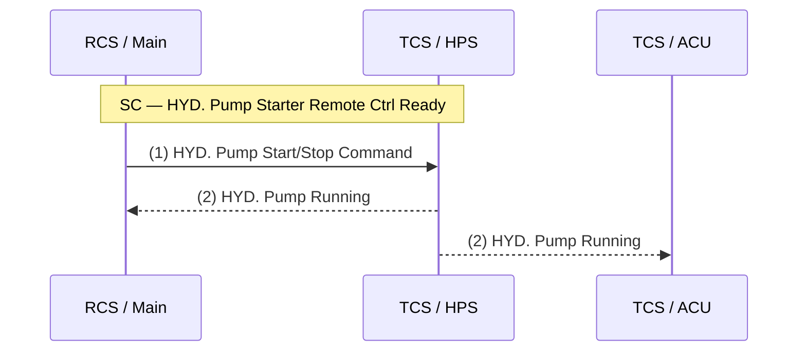

# Test Sheet — Data Structure Specification

Companion to [`PLAN.md`](PLAN.md). Defines the schema customers fill in.
A worked example is in [`customer_example.yaml`](customer_example.yaml).

> **Revision 0.6 changes (2026-06-13)** — lineage, lifecycle governance,
> semantic bridge, and compatibility diff
>
> Added optional contract-governance and interoperability fields aligned with
> the broader ship integration contract direction.
>
> New additions:
>
> - `artefact.artifact_id`, `artefact.lifecycle_state`,
>   `artefact.deprecated_at`, `artefact.sunset_at`, `artefact.replaced_by`
> - `function.lifecycle_state` (+ deprecation metadata)
> - `signal.lifecycle_state` (+ deprecation metadata)
> - semantic bridge fields on `signal`: `quantity`, `semantic_class`,
>   `vis_local_id`, `unit_iri`, `provenance`, `processing`
> - `lineages` top-level model with `signal_ref` + ordered `hops`
>   (`actor`, `rule`, `rule_params`, `input_contract`, `output_contract`)
>
> Added validation rules:
>
> - `SIG018` — artefact lifecycle state coherence
> - `SIG019` — deprecated/withdrawn lifecycle requirements on artefact,
>   function, and signal
> - `SIG020` — lineage integrity (actor existence, contiguous steps,
>   chain continuity)
>
> Added CLI support:
>
> - `si-schema diff-contract old.yaml new.yaml` to produce machine-readable
>   compatibility diff report.

> **Revision 0.5 changes (2026-06-13)** — broader ship integration
> contract direction
>
> The schema now introduces optional contract-level objects so SI projects can
> evolve from signal-only test sheets toward interface-centric integration
> contracts while keeping backward compatibility for existing rev-0.4 files.
>
> Added optional top-level entities:
>
> - `artefact` (`ArtifactMeta`) — artifact role, status, compatibility,
>   release metadata
> - `parties` (`list[Party]`) — generalized actors beyond vendors
> - `protocol_bindings` (`list[ProtocolBinding]`) — explicit Level-3 protocol
>   contracts
> - `mode_definitions` (`list[ModeDefinition]`) — operating mode definitions
> - `authority_rules` (`list[AuthorityRule]`) — command ownership/arbitration
> - `alarm_definitions` (`list[AlarmDefinition]`) — alarm behavior semantics
> - `interfaces` (`list[Interface]`) — top-level interface contract boundary
> - `acceptance_cases` (`list[AcceptanceCase]`) — FAT/SAT-oriented acceptance
>   semantics
>
> Added optional signal-level references:
>
> - `signal.producer`
> - `signal.interface_ref`
> - `signal.protocol_binding_ref`
> - `signal.mode_ref`
> - `signal.alarm_ref`
>
> Added validation rules:
>
> - `SIG014` — released artifact requires `contract_version` and
>   `published_at`
> - `SIG015` — `signal.producer` must reference known party/vendor
> - `SIG016` — new object references must resolve
> - `SIG017` — interface/acceptance signal links must resolve to
>   `(function_no, signal_id)`

> **Revision 0.4 changes (2026-05-15)** — internal SI workflow fields
>
> Two new optional fields added to `Signal`, used by the SI Data Explorer
> to track provenance and confidence. Both default to falsy values, so
> rev-0.3 YAML files round-trip unchanged.
>
> - `signal.assumed` — `bool`, default `false`. Set `true` when the value
>   could not be extracted verbatim from a vendor source document and was
>   instead inferred by the System Integrator. The Data Explorer renders
>   a *needs SI confirmation* badge for assumed signals (validation rule
>   SIG014, severity `info`).
> - `signal.source_doc_ref` — `str`, default `""`. Pointer back to the
>   source-document fragment (e.g. `vfd_io_datasheet_revC.pdf#p4`) the
>   value was extracted from. Free text; not validated.
>
> **Revision 0.3 changes (2026-05-14)**
>
> - Added richer signal mapping semantics and validation guidance for
>   `value_mapping` in both discrete and linear forms.
>
> **Revision 0.2 changes (2026-05-14)** — based on shipyard feedback and
> vendor IO datasheets `Screenshot 2026-05-14 152025.png` (DO) and
> `161837.png` (AI):
>
> - Documented `Module` semantics (physical or logical subdivision; flexible).
> - Clarified `control_authority` (issues primary/initiation command) vs
>   `related_systems` (participate via signals but do not issue the
>   initiation command; unordered, must be exhaustive).
> - Standardised the precondition term as **"Start Condition" (`SC`)** and
>   trip term as **"Trip Condition" (`TC`)** — used consistently everywhere.
> - Renamed `signal_name` semantics: it is a **vendor-neutral logical name**,
>   not a vendor IO tag. Vendor-specific tags live in
>   `signal.vendor_io_mappings[]`.
> - Added `signal.value_mapping` (structured digital/analog mapping).
> - Added `signal.subtype` (`NO`/`NC`, `steady`/`pulse`, sine/cosine, ...).
> - Added `signal.pulse_shape` (period, duty, count, pattern).
> - Added `signal.value_description` (free-text).
> - Added `signal.vendor_io_mappings[]` — captures per-vendor IO datasheet
>   columns (item, terminal, signal_type, details, logic, functionality, rev).

---

## 1. Top level

| Field        | Type               | Required | Description                                           |
|--------------|--------------------|----------|-------------------------------------------------------|
| `project`    | `ProjectMeta`      | yes      | Project identifiers.                                  |
| `parties`    | `list[Party]`      | no       | Party registry referenced by `vendor_io_mappings[]`.  |
| `components` | `list[Component]`  | yes      | All integration components referenced anywhere.       |
| `connections`  | `list[Connection]`   | yes      | Connectivity model across ports/components. |
| `functions`  | `list[Function]`   | yes      | Every function to be tested.                          |
| `signals`    | `list[Signal]`     | yes      | Project-level signal registry.                        |
| `glossary`   | `dict[str, str]`   | no       | Acronym expansions.                                   |

### 1A. Contract-level optional entities (rev 0.0.5)

These entities are optional in rev 0.0.5 but provide the structure needed for
interface-centric ship integration contracts.

| Field | Type | Required | Description |
|---|---|---|---|
| `artefact` | `ArtifactMeta` | no | Artifact role/status/version metadata for release governance. |
| `parties` | `list[Party]` | no | Actors involved in production, integration, operation, and analytics. |
| `protocol_bindings` | `list[ProtocolBinding]` | no | Protocol-level data contract details (family, transport, exchange pattern, timing). |
| `mode_definitions` | `list[ModeDefinition]` | no | Reusable operating mode definitions. |
| `authority_rules` | `list[AuthorityRule]` | no | Command ownership and arbitration rules. |
| `alarm_definitions` | `list[AlarmDefinition]` | no | Alarm semantics (priority, latching, ack/reset, visibility). |
| `interfaces` | `list[Interface]` | no | Interface contract boundaries with endpoint refs and signal membership. |
| `acceptance_cases` | `list[AcceptanceCase]` | no | Acceptance criteria and witness-oriented test semantics. |
| `lineages` | `list[Lineage]` | no | Multi-party transformation chain per signal (`function_no` + `signal_id`). |

> **Serialisation.** The schema is defined as a Pydantic / JSON Schema model
> and is **serialisation-agnostic**. YAML is the recommended authoring format
> for test-sheet files because it supports comments, multi-line strings and
> produces reviewable diffs, but every example in this document round-trips
> losslessly to JSON via `yaml.safe_load` → `json.dumps`. The canonical
> machine-readable artefact published alongside the spec is
> `si_schema.schema.json` (JSON Schema, draft 2020-12), generated from the
> same Pydantic models.

## 2. `ProjectMeta`

| Field           | Type   | Required | Notes                                          |
|-----------------|--------|----------|------------------------------------------------|
| `project_id`    | `str` (slug)  | yes      | Stable project key, e.g. `eps_demo`.           |
| `project_name`  | `str`  | no       | Human-readable project title.                  |
| `schema_version`| `str`  | no       | `0.0.4`, `0.0.5`, or `0.0.6` (default `0.0.6`). |
| `client`        | `str`  | no       | Shipyard or customer name.                     |
| `vessel_type`   | `str`  | no       | Vessel classification string.                  |
| `revision`      | `str`  | no       | Project revision label.                        |
| `date`          | `date` | no       | ISO-8601.                                      |

```yaml
project:
  project_id: eps_demo
  project_name: Electric Propulsion System
  schema_version: "0.0.6"
  client: Shipyard A
  vessel_type: LNG Carrier
  revision: 0.2.0
  date: 2026-05-14
```

## 3. `Party`

Used to scope vendor IO tag conventions and identify integration parties.
Adding a party is optional, but once any signal has `vendor_io_mappings[]`,
the referenced `party_id` must exist here.

| Field      | Type   | Required | Notes                                       |
|------------|--------|----------|---------------------------------------------|
| `id`       | `str` (slug) | yes | Stable cross-reference, e.g. `VFD_VENDOR`.  |
| `name`     | `str`  | yes      | Display name, e.g. `Vendor A Variable Speed Drive`. |
| `kind`     | `PartyKind` | no  | `vendor`, `integrator`, `shipyard`, `shipowner`, `class_society`, `analytics_provider`, `operator`. Default `vendor`. |
| `role`     | `str`  | no       | Free-text role description.                 |
| `contact`  | `str`  | no       | Contact information.                        |

```yaml
parties:
  - id: VFD_VENDOR
    name: VFD vendor (Vendor A · variable-speed drive)
    kind: vendor
  - id: YARD_INTEGRATOR
    name: Yard SI Team
    kind: integrator
```

## 4. `Component`

`Component` replaces the legacy `System` concept. It is the execution host and
interface container in the integration topology.

| Field | Type | Required | Notes |
|---|---|---|---|
| `id` | `str` (slug) | yes | Stable cross-reference key, e.g. `RCS`. |
| `name` | `str` | yes | Display name. |
| `modes` | `list[Mode]` | no | Vendor-owned canonical mode catalog for this component. |
| `modules` | `list[Module]` | no | Physical/logical subdivisions. |
| `ports` | `list[Port]` | no | Interface endpoints used for connection and signal semantics. |
| `vendor` | `str` | no | Free-text or mapped vendor identifier. |
| `notes` | `str` | no | Free text. |

The ownership boundary is important:

- **Vendor responsibility:** define the component's canonical modes and the
  vendor function preconditions that depend on those modes, and signal-level
  interface semantics required for SI mapping.
- **System-integrator responsibility:** compose vendor-provided component-level
  functions/signals into system-level behavior and architecture (including
  Connection and SysML v2 artifacts).

```yaml
components:
  - id: RCS
    name: Remote Control Component
    modes:
      - id: remote
        name: Remote
        description: Remote command ownership active.
      - id: local
        name: Local
        description: Local panel command ownership active.
    modules:
      - { id: Main, name: "Main Controller", description: "Primary" }
      - { id: Backup, name: "Backup Controller", description: "Redundant" }
    ports:
      - id: cmd_out
        direction: out
        port_type: Signal
        protocol: hardwired
      - id: status_in
        direction: in
        terminals: [X1-02]
```

### 4A. `Mode`

Each `Mode` is one canonical vendor-defined operating mode on a component.

| Field | Type | Required | Notes |
|---|---|---|---|
| `id` | `str` (slug) | yes | Stable key for SI references, e.g. `remote`. |
| `name` | `str` | no | Display label. |
| `description` | `str` | yes | Required semantics for the mode. |

## 5. `Module`

> **Definition.** A `Module` represents a **physical or logical subdivision
> of a `Component`**. It may be a physical controller, a software unit, or a
> functional partition that must be represented independently.

| Field  | Type         | Required | Notes                                  |
|--------|--------------|----------|----------------------------------------|
| `id`   | `str` (slug) | yes      | Unique within the parent component.    |
| `name` | `str`        | yes      | e.g. `Main`, `Backup`, `ACU`, `HPS`.   |
| `description` | `str` | no       | Free text — e.g. `Primary controller`. |

## 6. `Port`

Port is a dedicated first-class interface entity (industrial recommendation).

| Field | Type | Required | Notes |
|---|---|---|---|
| `id` | `str` (slug) | yes | Unique within parent component. |
| `direction` | enum | yes | `in` \| `out` \| `undefined`. |
| `module_id` | `str` (slug) | no | Optional owning module within the same component. |
| `terminals` | `list[str]` | no | Terminal or pin mapping. |
| `port_type` | enum | conditional | Required when `direction=out`; optional for `in` or `undefined`. Values: `Signal`, `CAN-TC`, `Analog`, `Resistor`, `4-20mA`, `0-10V`, `Serial`, `Network`. |
| `protocol` | enum/string | conditional | Required when `direction=out`; optional for `in` or `undefined`. E.g. `Modbus TCP`, `Modbus RTU`, `OPC-UA`, `hardwired`. |
| `attributes` | `object` | no | Additional technical metadata. |

Ontology semantics tied to Port:

- `connectedTo`: Port -> Port
- `actUpon`: Port -> Signal
- `isActedUponBy`: Signal -> Port (derived inverse)

### 6A. Ontology relation catalog

Industrial best practice is to keep **predicate relations** separate from
ordinary schema references.

#### Core ontology predicates

| Relation | Domain | Range | Bound in schema | Notes |
|---|---|---|---|---|
| `connectedTo` | `Port` | `Port` | `connections[*].from_port_ref` / `connections[*].to_port_ref` | Physical or logical connectivity edge. |
| `actUpon` | `Port` | `Signal` | `Port.attributes.actUpon` | Port processes/transmits/consumes the signal. |
| `isActedUponBy` | `Signal` | `Port` | derived from `actUpon` | Inverse relation; not authored directly. |

#### Schema reference bindings used with the ontology layer

These are not RDF predicates, but they are the key cross-object bindings used
for SI function mapping.

| Binding | From | To | Bound in schema | Notes |
|---|---|---|---|---|
| `component_id` | `Function` | `Component` | `Function.component_id` | ID of the component the function is allocated to (if already allocated). |

## 7. `Function`

One unified hierarchical function entity. No separate system-level/component-
level function types.

| Field | Type | Required | Notes |
|---|---|---|---|
| `id` | `str` (slug) | yes | Stable function identifier. |
| `name` | `str` | yes | Display name. |
| `component_id` | `str` | yes | ID of the component this function is allocated to, if already allocated. |
| `modes` | `list[str]` | yes | References to `Component.modes[*].id` for the function's component. |
| `input_signals` | `list[Signal]` | no | Signals consumed by the function. |
| `output_signals` | `list[Signal]` | no | Signals produced by the function. |
| `parameters` | `list[Parameter]` | no | Function parameters with fields `name` and `type`. |
| `function_description` | `str` | yes | Required vendor free text describing function behavior for SI mapping. Include applicable standards and references (e.g., DNV-RP-0684 Annex A, SysML v2, or domain-specific standards) with relevant version, section, and constraint details. |

`Function` is the central mapping entity in SI-schema:

- Vendor input must describe real operational behavior in `function_description`.
- Only **one allocated component_id** is allowed per function.
- SI maps system-level intent to component-level behavior using function metadata and free text.

```yaml
functions:
  - id: fn.rcs_vfd_start
    name: RCS orchestrated VFD start
    component_id: RCS
    modes:
      - remote
    input_signals:
      - id: start_cmd
        name: START COMMAND
        signal_type: Digital
        category: command
    output_signals:
      - id: pump_running
        name: PUMP RUNNING
        signal_type: Digital
        category: feedback
    parameters:
      - name: start_timeout_ms
        type: int
    function_description: |
      Validate start permissives, issue start/stop command logic,
      and describe dependencies, limits, and failure behavior.
```

### 7A. Function Mode References

Each function mode entry references one canonical mode on the allocated component.

| Field | Type | Required | Notes |
|---|---|---|---|
| `mode_id` | `str` (slug) | yes | Must match a value in `Component.modes[*].id` for `function.component_id`. |

## 8. `Connection`

`Connection` models a directed connectivity edge between interface endpoints.
Each connection transmits exactly one signal.

| Field | Type | Required | Notes |
|---|---|---|---|
| `id` | `str` (slug) | yes | Connection ID. |
| `from_port_ref` | `str` | yes | Fully qualified source port reference. |
| `to_port_ref` | `str` | yes | Fully qualified target port reference. |
| `connection_type` | enum | yes | `physical` \| `logical` \| `control` \| `data` (project profile). |
| `signal` | `str` | yes | Signal ID transmitted through this connection. |
| `properties` | `object` | no | Optional additional metadata. |

## 9. `Signal`

| Field | Type | Required | Notes |
|---|---|---|---|
| `id` | `str` (slug) | yes | Stable signal ID. |
| `name` | `str` | yes | Vendor-neutral signal name. |
| `signal_type` | enum | yes | `Digital`, `Analog`, `CAN`, `I2C`, `1-wire`, `UART`. |
| `category` | enum | yes | `command`, `permission/interlock`, `feedback`, `safety`, `mode`, `monitoring`. |
| `subtype` | `list[str]` | no | E.g. `NC`, `NO`, `Pulse`. |
| `processing` | `object` | no | `filtered`, `delay`, `moving_average`. |
| `attributes` | `object` | no | Scaling, sampling, fail-safe, redundancy, sync/async, compatibility notes. |
| `value_mapping` | `ValueMapping` | no | Optional raw/physical mapping. |

```yaml
signals:
  - id: engine_speed_cmd
    name: ENGINE SPEED COMMAND
    signal_type: Analog
    category: command
    processing:
      filtered: false
      delay_ms: 0
      moving_average_window: null
    attributes:
      scaling: 1.0
      sampling_interval_ms: 100
      fail_safe_mode: hold_last
      sync_mode: sync
```
      pulse_count: 1
    value_description: "Single 500 ms pulse triggers the start sequence."

# Analog command signal with linear mapping and a vendor IO row:
  - id: speed_setpoint
    name: "SPEED SETPOINT"
    signal_type: Analog
    category: command
    subtype: [single_ended]
    value_mapping:
      kind: linear
      raw:      { low: 4, high: 20,   unit: mA  }
      physical: { low: 0, high: 1188, unit: rpm }
      ramp:     "Two-direction turning; ramp up 0–70 %, ramp up 70–100 %"
    notes: >
      Motor shaft speed setpoint. When MSC is in speed regulation, the VFD
      follows this setpoint. Loop monitoring by FC; on 0 mA (e.g. wire
      break) the setpoint is frozen and an alarm is raised.
    vendor_io_mappings:
      - party_id:      VFD_VENDOR
        item:          AI00
        direction:     IN
        signal_type:   "4-20mA"
        terminals:     ["-XD04: 01", "-XD04: 02"]
        details:       "Insulation 2.3 kV; Input Impedance 20 Ω"
        logic:         "4 mA = 0 rpm; 20 mA = 1188 rpm; ramp up 0–70 %, 70–100 %"
        revision: A
```

## 10. Enums

### 9.1 `FunctionCategory` — six top-level categories (A–F)

Each signal must be assigned exactly one top-level `function_category`. The
optional `function_subcategory` field carries a finer-grained label drawn
from (or extending) the suggested vocabulary below. The validator should
warn — not error — when a subcategory is not in the suggested list, so the
schema stays open to project-specific refinements.

| Category (A–F)    | Meaning                                                          | Suggested subcategories                                       |
|-------------------|------------------------------------------------------------------|---------------------------------------------------------------|
| `Command`         | Actuation request issued by the control authority.               | `Start/Stop`, `Speed reference`, `Power reference`            |
| `Permission`      | Interlock / readiness / authorisation condition.                 | `Start Permission`, `Shaft Lock status`, `Ready/Not ready`    |
| `Feedback`        | Measured/observed value reported back from the actuator.         | `Speed`, `Power`, `Position`, `Status`                        |
| `Protection`      | Safety-related trip / shutdown / emergency signal.               | `Emergency Stop`, `Trip/Shutdown`                             |
| `Mode`            | Operating-mode selection or indication.                          | `Local/Remote`, `Main/Backup`, `Gas/Diesel`                   |
| `Monitoring`      | Continuous condition monitoring (non-safety).                    | `Power flow / available power`, `Temperature`, `Overload`, `Voltage` |

Machine-readable form:

```yaml
FunctionCategory:
  Command:
    description: Actuation request issued by the control authority.
    suggested_subcategories:
      - Start/Stop
      - Speed reference
      - Power reference
  Permission:
    description: Interlock / readiness / authorisation condition.
    suggested_subcategories:
      - Start Permission
      - Shaft Lock status
      - Ready/Not ready
  Feedback:
    description: Measured/observed value reported back from the actuator.
    suggested_subcategories:
      - Speed
      - Power
      - Position
      - Status
  Protection:
    description: Safety-related trip / shutdown / emergency signal.
    suggested_subcategories:
      - Emergency Stop
      - Trip/Shutdown
  Mode:
    description: Operating-mode selection or indication.
    suggested_subcategories:
      - Local/Remote
      - Main/Backup
      - Gas/Diesel
  Monitoring:
    description: Continuous condition monitoring (non-safety).
    suggested_subcategories:
      - Power flow
      - Available power
      - Temperature
      - Overload
      - Voltage
```

> **Migration note.** Earlier drafts used `Indication` and `Alarm` as
> top-level categories. These are now dropped:
> - status indications collapse into `Feedback` (subcategory `Status`) or
>   `Mode` depending on intent;
> - alarms collapse into `Protection` (subcategory `Trip/Shutdown`) or
>   `Monitoring` depending on whether they cause a trip.

### 9.2 Other enums

```yaml
LinkType:
  - hardwired
  - serial
  - network       # Ethernet / fieldbus
  - wireless

SignalType:
  - Digital
  - Analog
  - CAN
  - I2C
  - 1-wire
  - UART

SignalCategory:
  - command
  - permission/interlock
  - feedback
  - safety
  - mode
  - monitoring

PortDirection:
  - in
  - out
  - undefined

PortType:
  - Signal
  - CAN-TC
  - Analog
  - Resistor
  - 4-20mA
  - 0-10V
  - Serial
  - Network

ConnectionType:
  - physical
  - logical
  - control
  - data
  - status

MappingKind:
  - discrete
  - linear

Direction:
  - IN
  - OUT

DataType:
  - digital
  - analog_4_20mA
  - analog_0_10V
  - analog_potentiometer
  - serial
  - network

SignalSubtype:
  # digital
  - NO            # normally open
  - NC            # normally closed
  - steady
  - pulse
  # analog
  - sine_cosine
  - single_ended
  - differential

# Standard precondition / trip vocabulary — use exactly these tokens.
SignalOrderConvention:
  - "SC"          # Start Condition (precondition / interlock; evaluated before sequence)
  - "TC"          # Trip Condition (safety trip; evaluated continuously)
  - "<n>"         # plain ordinal step
  - "<n>-Main"    # ordinal for Main path
  - "<n>-Backup" # ordinal for Backup path
  - "<n>-Start"   # Start branch of a Start/Stop pair
  - "<n>-Stop"    # Stop branch of a Start/Stop pair
```

> **Terminology decision.** *prerequisite*, *precondition* and
> *start condition* all appear in customer source material. We standardise on
> **"Start Condition" / `SC`** and **"Trip Condition" / `TC`** in this
> schema. Any synonym in source material must be normalised to these two
> tokens during intake.

## 11. `ValueMapping`

Structured raw-signal → physical-quantity mapping. Choose one of two shapes.

### 10a. Digital — discrete values

```yaml
value_mapping:
  kind: discrete
  entries:
    - { raw: 0, meaning: "open"   }
    - { raw: 1, meaning: "closed" }
```

### 10b. Analog — linear range

```yaml
value_mapping:
  kind: linear
  raw:      { low: 4, high: 20,   unit: mA }
  physical: { low: 0, high: 1188, unit: rpm }
  ramp:     "0–70 % linear, 70–100 % shaped"   # optional free text
```

| Field      | Type                                    | Required    | Notes |
|------------|-----------------------------------------|-------------|-------|
| `kind`     | `discrete`/`linear`                     | yes         | Selects which subkeys are valid. |
| `entries`  | `list[{raw, meaning}]`                  | discrete only | Each row is one digital value. |
| `raw`      | `{low: number, high: number, unit: str}`| linear only | Raw electrical endpoints. `unit` is a separate field (e.g. `mA`, `V`). |
| `physical` | `{low: number, high: number, unit: str}`| linear only | Physical-quantity endpoints with their own unit (e.g. `rpm`, `bar`). |
| `ramp`     | `str`                                   | no          | Free-text ramp description if non-linear. |

> **Revision 0.5 (units separated).** Previous revisions encoded units
> inline as strings (e.g. `low: "4 mA"`). From rev 0.0.5 the unit is its
> own field so that values can be edited and validated as numbers.
> Loaders SHOULD accept the legacy string shape and split on the first
> whitespace for backward compatibility; writers MUST emit the new shape.

## 12. `PulseShape`

Required when `subtype` includes `pulse`.

| Field          | Type    | Required | Notes                                     |
|----------------|---------|----------|-------------------------------------------|
| `period_ms`    | `float` | no       | Pulse period in milliseconds.             |
| `width_ms`     | `float` | no       | Pulse width / on-time.                    |
| `duty_cycle`   | `float` | no       | 0.0–1.0; redundant with width if period set. |
| `pulse_count`  | `int`   | no       | Number of pulses per actuation.           |
| `pattern`      | `str`   | no       | Free-text pattern, e.g. `1-2-1` Morse-like. |

```yaml
pulse_shape:
  width_ms: 500
  pulse_count: 1
```

## 13. `VendorIOMapping`

Captures one row of a vendor IO datasheet (see screenshots
`152025.png` and `161837.png`). One signal may have several mappings — for
example the same `START COMMAND` may appear as different items on the VFD
vendor's DI list and on the RCS vendor's DO list.

| Field           | Type   | Required | Notes |
|-----------------|--------|----------|-------|
| `party_id`      | `str` (slug) | yes | Must match `Party.id`. |
| `item`          | `str`  | yes      | Vendor item code, e.g. `AI00`, `DO17`, `DI11`. |
| `direction`     | `str`  | no       | `IN` / `OUT` from the vendor's perspective. |
| `signal_type`   | `str`  | no       | Free text from datasheet, e.g. `4-20mA`, `2 CONTACTS RELAY`, `4 CONTACTS RELAY`. |
| `terminals`     | `list[str]` | no  | Physical terminals, e.g. `["-XD04: 01", "-XD04: 02"]`. |
| `no_nc`         | `str`  | no       | `NO` or `NC` for relay outputs. |
| `s_p`           | `str`  | no       | `Steady` or `Pulse` (S/P column). |
| `l_r`           | `str`  | no       | `L`, `R`, or `L+R` (local/remote scope). |
| `details`       | `str`  | no       | e.g. `Insulation 2.3 kV, Input Impedance 20 Ω`, `DRY CONTACTS 5A/250VAC`. |
| `logic`         | `str`  | no       | Vendor logic column, e.g. `4mA = 0 rpm; 20mA = 1188 rpm`. |
| `functionality` | `str`  | no       | Vendor functionality narrative column. |
| `revision`      | `str`  | no       | Vendor sheet revision letter, e.g. `A`, `B`, `C`. |

```yaml
# DO17 — 4-contact relay row from the VFD vendor IO datasheet (rev C):
vendor_io_mappings:
  - party_id:      VFD_VENDOR
    item:          DO17
    direction:     OUT
    signal_type:   "4 CONTACTS RELAY"
    terminals:
      - "-XD03: 57"
      - "-XD03: 58"
      - "-XD03: 59"
      - "-XD03: 60"
      - "-XD03: 61"
      - "-XD03: 62"
      - "-XD03: 63"
      - "-XD03: 64"
    no_nc:         NO
    s_p:           Steady
    l_r:           "L+R"
    details:       "DRY CONTACTS (5A/250VAC, 5A/30VDC)"
    logic:         "0 = no VFD load reduction; 1 = VFD load reduction or power limitation"
    functionality: >
      Activated when there is an effective load reduction (DI8=1) or a DG
      shutdown (DI11=1), due to an overtemperature for example.
    revision: C
```

> Note: `value_mapping` (§11) is the **canonical, vendor-neutral** mapping.
> The `logic` field on `VendorIOMapping` is the verbatim text from the
> vendor's datasheet and may be redundant with `value_mapping`. The
> validator should warn if they disagree.

## 14. Validation rules

The Pydantic / JSON Schema layer must enforce the rules below. Each rule
carries a stable `SIG###` identifier so downstream tools (the Data Explorer,
importers, generated reports) can reference and surface them by code.
Severity is **error** unless noted otherwise.

| ID       | Severity | Rule |
|----------|----------|------|
| `SIG001` | error    | Every `component_id` reference resolves in `components[*].id`. |
| `SIG002` | error    | Every `module_id` reference resolves inside the named component's `modules`. |
| `SIG003` | error    | Every `party_id` in `signal.vendor_io_mappings[*]` exists in `parties[*].id`. |
| `SIG004` | error    | `function.id` is unique within the project. |
| `SIG005` | error    | `signal.id` is unique within the project-level signal registry. |
| `SIG006` | error    | Every `connections[*].signal` matches an existing `signals[*].id`. |
| `SIG007` | error    | Each `component.modes[*].id` is unique within the component. |
| `SIG008` | error    | `function.component_id` exists in `components[*].id`. |
| `SIG014` | error    | A released artefact (`status: released`) must define `contract_version` and `published_at`. |
| `SIG015` | error    | Every `Connection` must reference valid Port -> Port endpoints. |
| `SIG016` | error    | `actUpon` links must be Port -> Signal only. |
| `SIG021` | error    | If `port.direction` is `out`, both `port_type` and `protocol` must be provided. |
| `SIG022` | error    | Every `function.modes[*]` entry must exist in `component.modes[*].id` for that function's `component_id`. |
| `SIG023` | error    | If `port.module_id` is set, it must exist in that component's `modules[*].id`. |
| `SIG024` | error    | If `component.vendor` is set, the referenced `parties[*]` entry must have `kind` equal to `vendor`. |

---

## 15. Excel front end (optional)

For customers more comfortable with Excel, the same schema maps to **seven
sheets per workbook**:

| Sheet              | Columns                                                                                  |
|--------------------|------------------------------------------------------------------------------------------|
| `Parties`           | party_id, name, kind, role, contact                                                      |
| `Components`       | component_id, name, modes (JSON), vendor, module_id, module_name, module_description, port_id, port_direction, port_type, protocol, terminals, notes |
| `Functions`        | function_id, name, component_id, modes (JSON), input_signals (JSON), output_signals (JSON), parameters (JSON), function_description |
| `Signals`          | signal_id, name, signal_type, category, subtype, processing (JSON), attributes (JSON), value_mapping (JSON), notes |
| `Connections`      | connection_id, from_port_ref, to_port_ref, connection_type, signal, properties (JSON) |
| `Ontology`         | subject_ref, predicate, object_ref, derived (bool), rule_notes |
| `VendorIOMappings` | function_no, signal_id, party_id, item, direction, signal_type, terminals (comma-sep), details, logic, revision |

A small importer (`pre-processing/test_sheet_intake.py`) converts the workbook
to YAML and runs the Pydantic validator.

---

## 16. Auto-generated outputs

From a single validated YAML, the generator produces:

1. **Function-list table** — Markdown / Excel.
2. **Per-function test sheet** containing:
  - Header table (Function / Modes / Inputs / Outputs / Parameters)
   - **IO classification table** (Markdown / Excel, sorted by `signal_order`)
  - **Port connection map** (`connectedTo` / `actUpon`)
   - **Vendor IO datasheet view** (per vendor) reproducing the layout in
     `Screenshot 2026-05-14 152025.png` / `161837.png`.
   - **Notes** block

### Mermaid example for `Hydraulic Pump Start/Stop`



---

## 17. Published artefact: `si_schema.schema.json`

The canonical machine-readable expression of this spec is a single
**JSON Schema (draft 2020-12)** document, published alongside the docs site at:

- https://dnv-opensource.github.io/si-schema/si_schema.schema.json

It encodes every entity in §§2 – §13 (`ProjectMeta`, `Party`, `Component`,
`Module`, `Port`, `Function`, `Connection`, `Signal`, plus the supporting
`ValueMapping`, `PulseShape`, `VendorIOMapping`) together
with the structural validation rules from §14 that can be expressed
declaratively (enums, `pattern` for `signal_order`, `required`, `oneOf`
for discrete/linear `ValueMapping`, `additionalProperties: false`).

**Cross-reference and inter-rule checks** (`SIG001`–`SIG008`, `SIG014`–`SIG024`)
are not expressible in pure JSON Schema; they are enforced by the
companion Pydantic validator. JSON Schema alone catches roughly 60 % of
authoring mistakes; the validator catches the remaining 40 %.

### Recommended consumption

- **IDE.** Add to `.vscode/settings.json`:
  ```json
  {
    "yaml.schemas": {
      "https://dnv-opensource.github.io/si-schema/si_schema.schema.json": [
        "**/test_sheet.yaml",
        "**/si-schema/**/*.yaml"
      ]
    }
  }
  ```
  Authors then get red squiggles, auto-completion and hover-docs in VS
  Code without installing anything.

- **CI.** Pipe a project's YAML through `check-jsonschema` (or any
  draft-2020-12 validator) using the published URL as the schema source,
  then run the Pydantic validator for the cross-reference rules.

- **Code generation.** The schema is consumable by
  `quicktype`, `datamodel-code-generator`, `openapi-generator` and any
  other tool that understands JSON Schema, so language bindings for
  Python, TypeScript, Java, etc. can be produced without re-modelling.

### Versioning

The `version` field at the root of the schema document tracks this spec
verbatim (currently `"0.0.6"`). Breaking changes bump the **minor**
component; backwards-compatible additions bump the **patch** component.
Major (`1.x`) is reserved for the first stable release.
